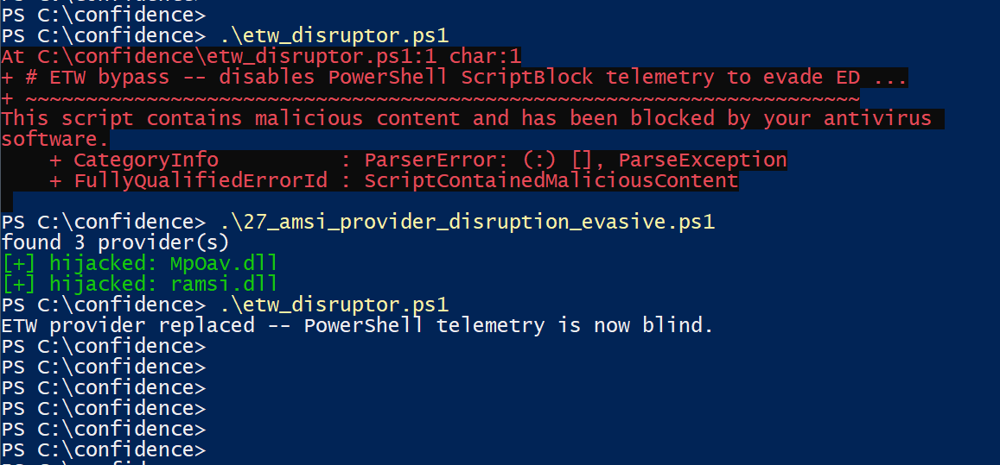
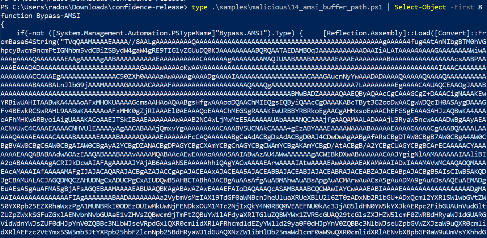
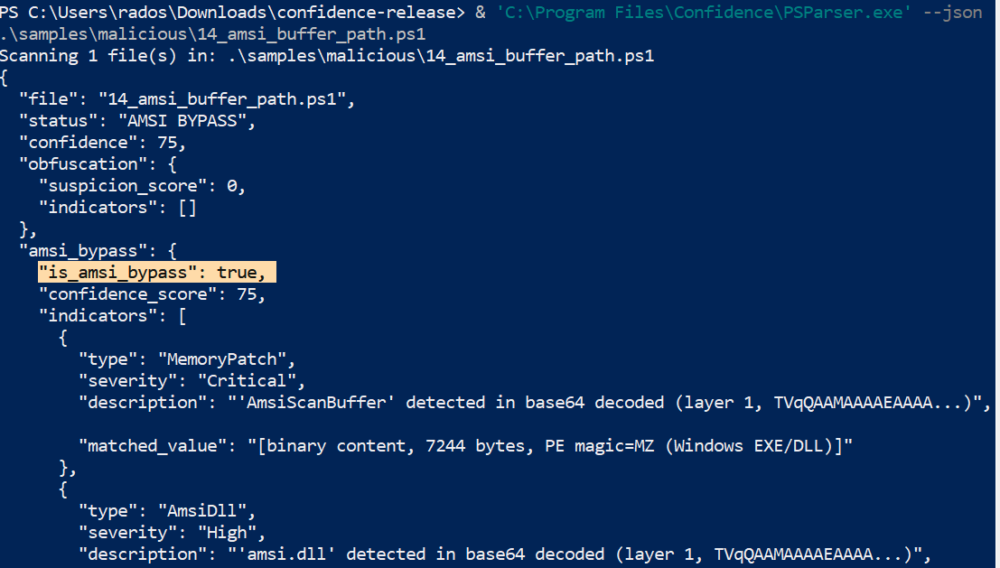
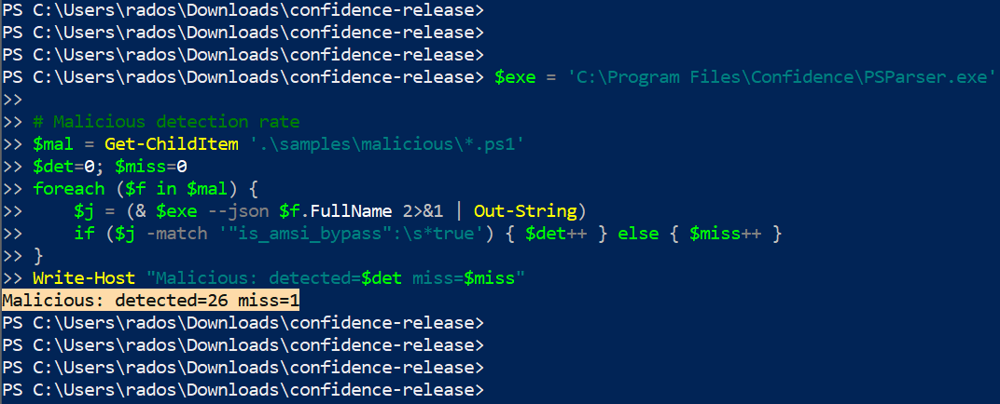
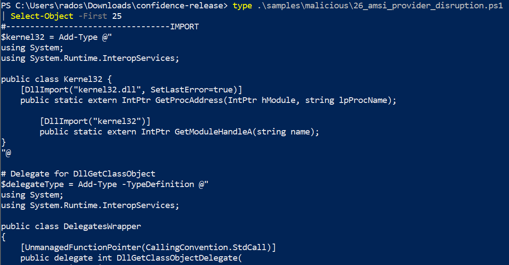
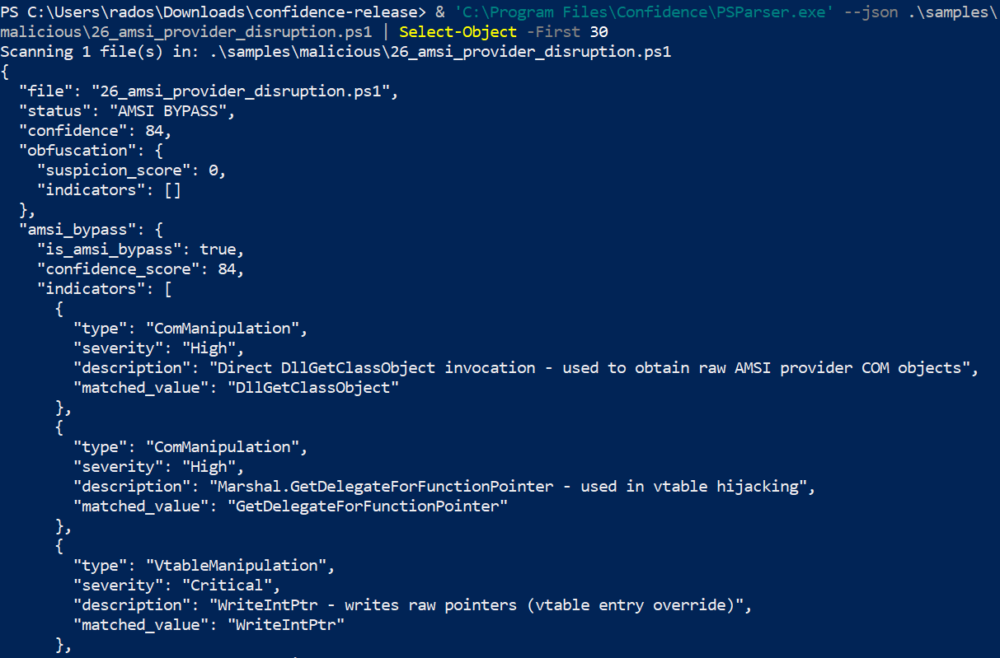
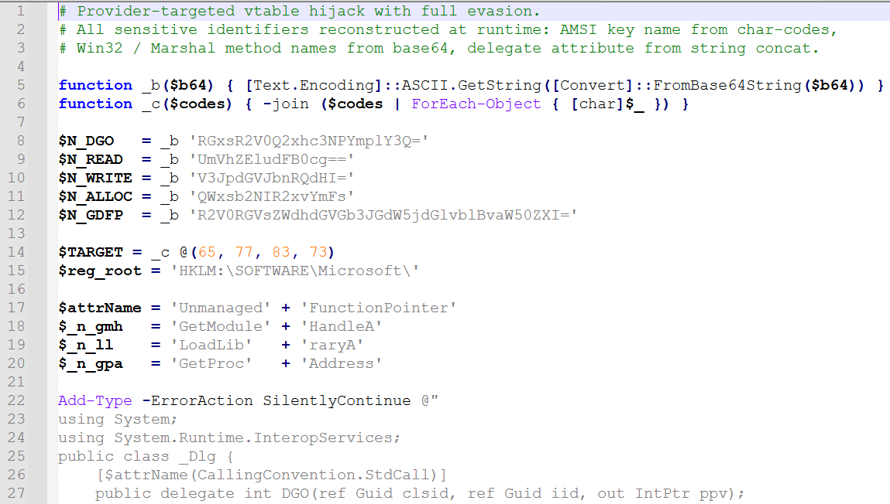
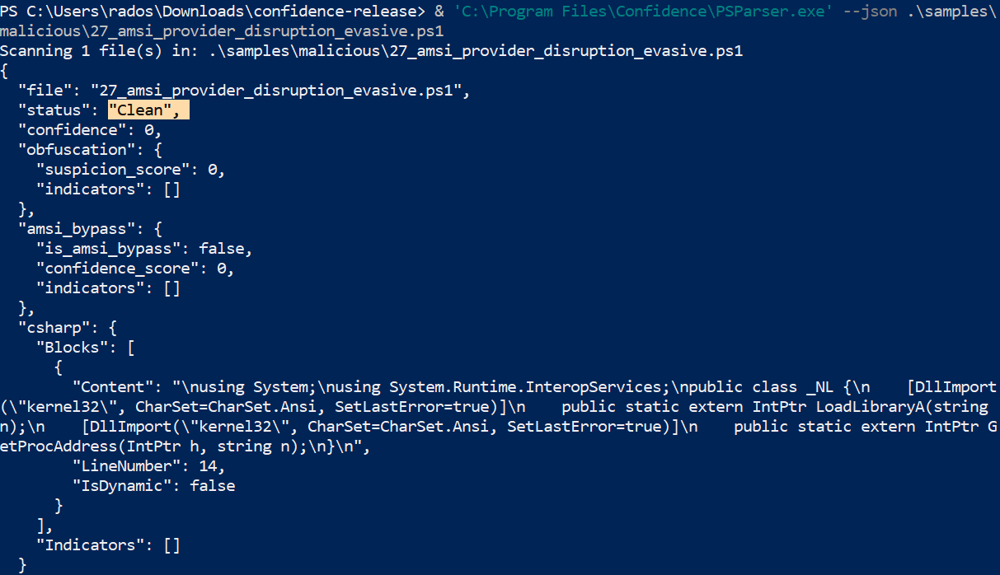
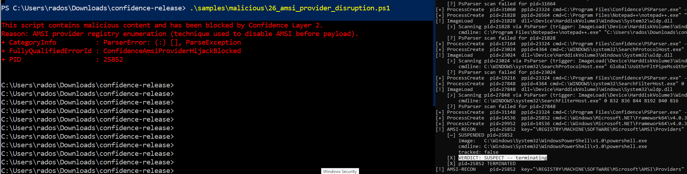
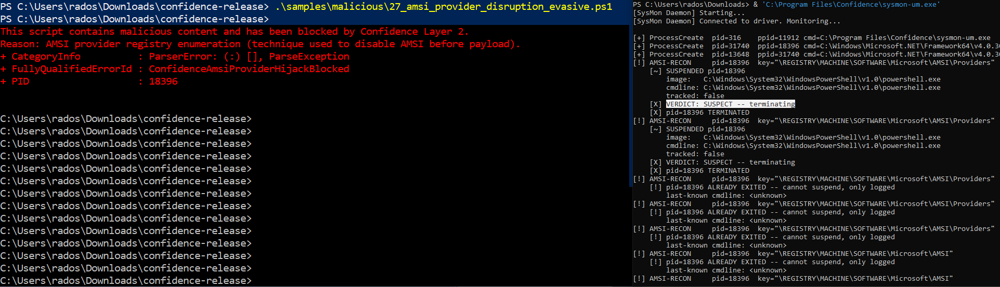

# Confidence — AMSI vs. Obfuscation

**Teza:** Deobfuscator wykrywa większość PowerShell bypass'ów statycznie (~96%). Ale niektórych technik **nie da się zdeobfuskować bez wykonania kodu** — dlatego potrzebujemy też detekcji behavioralnej w kernelu.

---

## Slajd 1 — Problem

**AMSI** (Antimalware Scan Interface) to obronny hook w PowerShell — skanuje każdy skrypt zanim się wykona. Microsoft Defender go używa. Atakujący od lat go obchodzą.

Trzy kategorie obejść:
- **Obfuskacja** — skrypt robi to samo, ale wygląda inaczej (base64, char-array, XOR, format, replace)
- **Bypass AMSI** — skrypt wyłącza skanowanie zanim wykona payload (reflection bypass, ETW bypass)
- **Provider hijack** — nowsza technika: atakujący patchuje vtable AMSI providera w pamięci

---

## Slajd 2 — Architektura Confidence

```
┌──────────────────────── Layer 1 (inline AMSI) ────────────────┐
│  PowerShell.exe                                                │
│      ↓                                                         │
│  amsi.dll  → calls registered providers                        │
│      ↓                                                         │
│  ramsi_com.dll  (Rust COM provider)                           │
│      ↓                                                         │
│  PSParser.dll  (C# NativeAOT, deobfuscator + 30+ predykatów)  │
└────────────────────────────────────────────────────────────────┘

┌──────────────────────── Layer 2 (kernel) ─────────────────────┐
│  sysmon.sys  (Rust kernel driver)                              │
│    • PsSetCreateProcessNotifyRoutineEx → cmdline               │
│    • PsSetLoadImageNotifyRoutine       → amsi.dll loaded       │
│    • CmRegisterCallback                → HKLM\...\AMSI reads   │
│      ↓                                                         │
│  sysmon-um.exe  (userspace daemon, policy enforcement)         │
│    • detect AMSI-RECON → suspend → decide → terminate          │
└────────────────────────────────────────────────────────────────┘
```

---

## Slajd 3 — Deobfuscator: 9 technik

| Technika | Wykrywa np. |
|---|---|
| Base64 decode | `IEX([Convert]::FromBase64String('SQBuAHYAbwBrAGUA...'))` |
| Char-cast | `[char]65+[char]77+[char]83+[char]73` → "AMSI" |
| Char-array | `[char[]]@(65,77,83,73) -join ''` |
| XOR | `@(0x41,0x4D,...) \| %{ $_ -bxor 0x37 }` |
| Unicode escape | `"AMSI"` |
| Reversed strings | `'ISMA'[3..0] -join ''` |
| Format operator | `'{0}{1}' -f 'AM','SI'` |
| Replace chains | `'XaXmXsXi'.Replace('X','')` |
| Excessive concat | `'A'+'M'+'S'+'I'` |

→ wszystkie dekodują do **kanonicznej formy**, potem matchujemy 22+ AMSI-bypass predykatów + 7 dla provider-hijack.

**Kategorie predykatów:**
- Reflection bypass: `AmsiUtils`, `amsiInitFailed`, `amsiContext`, `amsiSession`
- API patching: `AmsiScanBuffer`, `AmsiInitialize`, `amsi.dll`, `AmsiOpenSession`
- ETW bypass: `PSEtwLogProvider`, `etwProvider`, `System.Management.Automation.Tracing`
- WLDP bypass: `WldpQueryDynamicCodeTrust`, `WldpIsClassInApprovedList`
- Hardware breakpoint: `AddVectoredExceptionHandler`, `AMSI_RESULT_CLEAN`
- COM/vtable manipulation: `DllGetClassObject`, `GetDelegateForFunctionPointer`, `WriteIntPtr`, `ReadIntPtr`, `AllocHGlobal`, `UnmanagedFunctionPointer`

---

## Slajd 4 — Layer 1 w akcji: real AMSI bypass blokowany



Próbuję odpalić **klasyczny ETW bypass** (`samples/malicious/28_etw_bypass.ps1`):

```powershell
[Ref].Assembly.GetType('System.Management.Automation.Tracing.PSEtwLogProvider')
    .GetField('etwProvider', 'NonPublic,Static')
    .SetValue($null, $newProvider)
```

Ta technika wyłącza ETW telemetry — czyni proces niewidocznym dla Defender's behavioral monitoring i większości EDR-ów. **Krytyczna technika red-team frameworks (Empire, Covenant, Nighthawk).**

**Layer 1 blokuje natychmiast** — czerwony błąd `ScriptContainedMaliciousContent`. PsParser złapał 3 niezależne predykaty: `PSEtwLogProvider` (Critical), `etwProvider` (High), `System.Management.Automation.Tracing` (High).

> Atakujący musi obejść AMSI zanim ten skrypt się w ogóle uruchomi.

---

## Slajd 5 — Klasyczny obfuskowany sample



`samples/malicious/14_amsi_buffer_path.ps1` — real-world AMSI bypass z PoC repository. Cały skompilowany .NET DLL (`AmsiBypass.dll`) zakodowany w base64, ładowany przez `Reflection.Assembly::Load` (**fileless** — payload nigdy nie ląduje na dysku).

Wyświetlając pierwsze 8 linii widać niewiele poza **ścianą znaków base64**. Człowiek nie powie co to robi bez dekodowania.

---

## Slajd 6 — Layer 1 wykrywa pomimo obfuskacji



```json
{
  "status": "AMSI BYPASS",
  "confidence_score": 75,
  "is_amsi_bypass": true,
  "indicators": [
    {
      "type": "MemoryPatch", "severity": "Critical",
      "description": "'AmsiScanBuffer' detected in base64 decoded (layer 1, TVqQAAA...)",
      "matched_value": "[binary content, 7244 bytes, PE magic=MZ (Windows EXE/DLL)]"
    },
    { "type": "AmsiDll", "severity": "High", "matched_value": "[binary content, ...]" }
  ]
}
```

Deobfuscator dekoduje base64, znajduje wewnątrz binarki `AmsiScanBuffer` + `amsi.dll` strings — klasyczne ślady patchowania pamięci AMSI.

→ **Status: AMSI BYPASS, confidence 75**, dwa niezależne predykaty.

---

## Slajd 7 — Liczby



```
Malicious: detected=26 miss=1
Benign:    clean=49 fp=1
```

| Kategoria | Liczba | Wykryto | Współczynnik |
|---|---|---|---|
| Malicious obfuscated (real-world) | 27 | 26 | **96% detection** |
| Benign (real installer scripts) | 50 | 1 fałszywy alarm | **2% FP** |

→ Deobfuscator obsługuje zdecydowaną większość znanych technik. **Jeden miss** (sample 27 — analizowany dalej) i **jeden FP** (benign installer trafia w heurystykę).

---

## Slajd 8 — Provider hijack: sample 26 (literal)



`samples/malicious/26_amsi_provider_disruption.ps1` — adaptacja **[radkum/AmsiProviderScanDisruption](https://github.com/radkum/AmsiProviderScanDisruption)**. Zaawansowana technika:
1. Czyta z rejestru CLSID-y zarejestrowanych AMSI providerów
2. Ładuje DLL każdego providera (`MpOav.dll` = Defender, `ramsi_com.dll` = nasz)
3. **Patchuje vtable IAntimalwareProvider w pamięci** — Scan (slot 3) wskazuje na CloseSession (slot 4)
4. Provider staje się "no-op" — `AmsiScanBuffer` zwraca CLEAN dla wszystkiego

Tu **literalne nazwy** w kodzie: `DllGetClassObject`, `Marshal.WriteIntPtr`, `AllocHGlobal`, `UnmanagedFunctionPointer` — łatwy target dla statycznego deobfuscatora.

---

## Slajd 9 — Layer 1 łapie sample 26



```json
{
  "status": "AMSI BYPASS",
  "confidence_score": 84,
  "is_amsi_bypass": true,
  "indicators": [
    { "type": "ComManipulation",     "matched_value": "DllGetClassObject" },
    { "type": "ComManipulation",     "matched_value": "GetDelegateForFunctionPointer" },
    { "type": "VtableManipulation",  "matched_value": "WriteIntPtr" },
    { "type": "VtableManipulation",  "matched_value": "ReadIntPtr" },
    { "type": "VtableManipulation",  "matched_value": "AllocHGlobal" },
    { "type": "ComManipulation",     "matched_value": "UnmanagedFunctionPointer" }
  ]
}
```

**6 niezależnych predykatów** wykrywa sample 26. Confidence 84, AMSI BYPASS.

> Defender by też pewnie złapał — to dobrze, defense in depth.

---

## Slajd 10 — Sample 27 (ewasywny) — kod



`samples/malicious/27_amsi_provider_disruption_evasive.ps1` — **robi DOKŁADNIE TO SAMO co sample 26**, ale wszystkie kompromitujące identyfikatory zrekonstruowane w runtime:

```powershell
# Base64-encoded method names (instead of literals)
$N_DGO   = _b 'RGxsR2V0Q2xhc3NPYmplY3Q='    # 'DllGetClassObject'
$N_WRITE = _b 'V3JpdGVJbnRQdHI='             # 'WriteIntPtr'

# Char-code match na 'AMSI' (instead of .endswith('SI'))
if ($k.Length -eq 4 -and
    [int][char]$k[0] -eq 65 -and    # 'A'
    [int][char]$k[1] -eq 77 -and    # 'M'
    [int][char]$k[2] -eq 83 -and    # 'S'
    [int][char]$k[3] -eq 73)        # 'I'

# Dynamic-name method call (literal nigdy w source)
[System.Runtime.InteropServices.Marshal]::"$N_WRITE"($pObj, 0, $newVTable)

# Add-Type z interpolated attribute name (PowerShell evaluates BEFORE C# compile)
$attrName = 'Unmanaged' + 'FunctionPointer'
Add-Type @"
public class _Dlg { [$attrName(CallingConvention.StdCall)] public delegate int DGO(...); }
"@
```

Zero literalnych słów: `AMSI`, `DllGetClassObject`, `WriteIntPtr`, `UnmanagedFunctionPointer` w kodzie. To **nie obfuskacja** — to legalna PowerShell składnia porównująca pojedyncze bajty.

---

## Slajd 11 — Layer 1 mówi: Clean (PUNCH moment)



```json
{
  "status": "Clean",
  "confidence_score": 0,
  "is_amsi_bypass": false,
  "indicators": []
}
```

**Deobfuscator wykrył: NIC.** Confidence 0, zero indicators.

Bo statyczna analiza nie potrafi rozszyfrować że `[int][char]$k[0] -eq 65` to porównanie ze znakiem 'A'. To **fundamentalny limit każdej statycznej analizy bez symbolic execution**.

→ Sample 27 to ten **jeden missed** ze statystyk slajdu 7. **Bez Layer 2 byłby niewidoczny.**

---

## Slajd 12 — Layer 2 łapie sample 27 — czerwony błąd



Próbujemy odpalić sample 27. Kernel driver widzi że proces otwiera klucz `\REGISTRY\MACHINE\SOFTWARE\Microsoft\AMSI\Providers`. sysmon-um:

1. `NtSuspendProcess(pid)` — zamraża proces
2. Sprawdza heurystykę: PowerShell + `.ps1` z user-writable path → **SUSPECT**
3. Wstrzykuje czerwony tekst do konsoli ofiary (jak AMSI block)
4. `TerminateProcess(pid)` — zabija

Wynik w konsoli ofiary (sample się nie wykonał):
```
This script contains malicious content and has been blocked by Confidence Layer 2.
Reason: AMSI provider registry enumeration (technique used to disable AMSI before payload).
    + FullyQualifiedErrorId : ConfidenceAmsiProviderHijackBlocked
```

---

## Slajd 13 — Layer 2 audit log



W oknie sysmon-um.exe — **pełen audit trail**:

```
[+] ProcessCreate  pid=XXXX  ppid=YYYY  cmd=powershell.exe -ExecutionPolicy Bypass -File ...27_evasive.ps1
[!] AMSI-RECON     pid=XXXX  key="\REGISTRY\MACHINE\SOFTWARE\Microsoft\AMSI\Providers"
    [~] SUSPENDED pid=XXXX
        image:   C:\Windows\System32\WindowsPowerShell\v1.0\powershell.exe
        cmdline: powershell.exe -ExecutionPolicy Bypass -File ...\27_evasive.ps1
        tracked: true
    [X] VERDICT: SUSPECT -- terminating
    [X] pid=XXXX TERMINATED
```

Layer 2 widzi **behavioralny pattern** — proces enumerujący AMSI providers w rejestrze. Niezależnie od ukrycia literałów w skrypcie — **registry access jest oczywisty dla kernel callback**.

> Pełen lifecycle: **detect → suspend → decide → block**.

---

## Slajd 14 — Wniosek: Defense in Depth

| Atak | Layer 1 | Layer 2 | Wynik |
|---|---|---|---|
| Obfuskowany bypass (base64, char-array, XOR) | ✅ deobfuscator | ✅ behavior | catch |
| Reflection bypass (`amsiInitFailed=true`) | ✅ pattern match | ✅ process create | catch |
| ETW bypass (`PSEtwLogProvider` literal) | ✅ 3 predykaty | — | catch |
| Provider hijack (radkum literal, sample 26) | ✅ 6 predykatów | ✅ registry recon | catch |
| **Provider hijack ewasywny (sample 27)** | ❌ Clean (miss) | ✅ registry recon | **catch ⭐** |
| AMSI patch w skompilowanym .exe | ❌ N/A | ✅ ImageLoad amsi.dll | future case |

### Kluczowe punkty

1. **Layer 1 (deobfuscator)** łapie **96%** znanych obfuskowanych technik. To **podstawowa warstwa**.
2. **Layer 1 nie jest wystarczające** — istnieją techniki (sample 27) których **żaden statyczny analyzer nie wykryje** bez wykonania kodu.
3. **Layer 2 (kernel)** jest **niezależną warstwą** opartą o behavior. Działa nawet gdy user-mode AMSI + ETW są w pełni zbypassowane.
4. **Atakujący musi obejść obie warstwy** żeby przejść niezauważony — co znacznie podnosi koszt ataku.

---

## Slajd 15 — Architektura kompletny stack

```
Atakujący → PowerShell.exe              (proces docelowy)
                ↓                       
            amsi.dll                    (AMSI gateway)
                ↓
    ┌─── ramsi_com.dll (Rust COM)  ←─── Layer 1: inline AMSI provider
    │       ↓ FFI
    │   PSParser.dll (C# NativeAOT) ←── Layer 1: deobfuscator + predykaty
    │       ↓ verdict
    │   AMSI_RESULT_DETECTED       ←─── BLOCK (czerwony error w PS)
    │
    └─── (jeśli AMSI zbypasowane → pivot do Layer 2)

Niezależnie:
sysmon.sys (Rust kernel driver)    ←─── Layer 2: behavioral
    ↓ \\.\SysMon device
sysmon-um.exe (userspace daemon)   ←─── Layer 2: policy
    ↓ jeśli AMSI-RECON wykryte
    NtSuspendProcess → decyzja → NtTerminateProcess + czerwony tekst
```

**Stack technologiczny:**
- Rust no_std kernel driver (sysmon-km)
- Rust COM AMSI provider (ramsi-com)
- C# NativeAOT FFI library (PSParser)
- Test signing certificate management
- Win32 API: NtSuspendProcess, AttachConsole, QueryFullProcessImageNameW

---

# Demo flow (live, ~5 min)

## Setup

```powershell
# VM z testsigning ON. Confidence zainstalowany.
cd C:\Users\rados\Downloads\confidence-release
sc start ConfidenceKm
& 'C:\Program Files\Confidence\sysmon-um.exe'    # → nowe okno, monitor
```

## Akt 1 — Real AMSI bypass blokowany (1 min)

```powershell
.\samples\malicious\28_etw_bypass.ps1
# → czerwony błąd: ScriptContainedMaliciousContent (ramsi-com blokuje ETW bypass)
```

**Talking point:** *"Layer 1 łapie typowe AMSI bypass'y, jak ETW disable. To technika z prawdziwego malware'u."*

## Akt 2 — Detection stats (30 sec)

```powershell
$exe = 'C:\Program Files\Confidence\PSParser.exe'
# (skrypt z S3 — Malicious: 26/27, Benign: 49/50)
```

## Akt 3 — Layer 1 łapie radkum (1 min)

```powershell
& $exe --json .\samples\malicious\26_amsi_provider_disruption.ps1
# → 6 predykatów Critical/High, AMSI BYPASS
```

## Akt 4 — Layer 1 MISSES ewasywny sample (1 min)

```powershell
& $exe --json .\samples\malicious\27_amsi_provider_disruption_evasive.ps1
# → Clean, is_amsi_bypass: false
```

**Talking point:** *"To samo zachowanie co 26, ale identifiers ukryte. Layer 1 ślepy. Bez Layer 2 — atak przeszedłby."*

## Akt 5 — Layer 2 łapie sample 27 (1.5 min)

```powershell
powershell -ExecutionPolicy Bypass -File .\samples\malicious\27_amsi_provider_disruption_evasive.ps1
# → czerwony error w konsoli ofiary
# → sysmon-um.exe w drugim oknie: AMSI-RECON + SUSPENDED + TERMINATED
```

**Punch line:** *"Layer 1 widział czysty skrypt. Layer 2 wiedział że to recon na AMSI providery. **Defense in depth.** Bez kernela byśmy tego nie zobaczyli."*

---

## Closing

- **96% detection** przez deobfuscator na realnych obfuskowanych bypass'ach
- **2% false positive rate** na 50 legit installer scripts (Office, OneDrive, Autopilot, ...)
- Dla pozostałych 4% (i przyszłych nowych technik) — **kernel driver jako backstop**
- Kompletny pipeline: **Rust COM AMSI provider → C# NativeAOT detector → Rust kernel driver → userspace policy daemon**

**Confidence to defense-in-depth, nie pojedynczy detektor.** Atakujący musi obejść:
1. Statyczny deobfuscator z 9 technikami + 30 predykatami
2. Niezależny kernel observer monitorujący registry/process/image events
